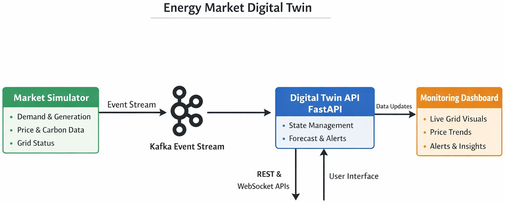

# ⚡ Industrial Energy Market Digital Twin

A **real-time, event-driven digital twin platform** for simulating, monitoring, and forecasting electricity market conditions.

This project demonstrates how to design a **modern distributed digital twin system** using **Kafka, FastAPI, Streamlit, and Docker**. It simulates electricity grid dynamics, streams system states through an event pipeline, and provides APIs and dashboards for operational monitoring.

🎯 **Goal:** Showcase an end-to-end architecture for **real-time energy system analytics and decision support**.

---

<p align="center">
  
</p>

<p align="center">
  <em>Figure: Event-driven digital twin architecture using Kafka, FastAPI, and Streamlit</em>
</p>

## 🚀 Key Features

- ⚡ Real-time electricity market simulation  
- 📡 Event-driven architecture using **Apache Kafka**  
- 🧠 Digital twin backend built with **FastAPI**  
- 📊 Interactive monitoring dashboard using **Streamlit + Plotly**  
- 🔌 REST and WebSocket APIs for real-time data access  
- 📈 Short-horizon forecasting and alert generation  
- 🐳 Fully containerized with **Docker Compose**  
- 🧩 Modular microservice architecture for extensibility  

---

## 🧠 Digital Twin Concept

A **digital twin** continuously mirrors the state of a physical or simulated system.

In this prototype:

1. A **market simulator** generates electricity system states  
2. Events are streamed through **Kafka**  
3. A **digital twin service** consumes events and maintains system state  
4. APIs and dashboards provide **live operational insights**  

---

## 🏗️ System Architecture

```text
Simulator → Kafka Topic (energy.market.states) → Digital Twin Backend (FastAPI) → Streamlit Dashboard
```

💡 The architecture enables **loose coupling**, allowing new services to subscribe to Kafka streams without modifying existing components.

---

## ⚡ Simulated Grid Variables

The simulator models key electricity market metrics:

- Electricity demand  
- Solar generation  
- Wind generation  
- Conventional generation  
- Battery storage levels  
- Interconnector imports  
- Reserve margin / grid imbalance  
- Electricity price  
- Carbon intensity  
- Renewable energy share  
- Grid operational status  

---

## 🧩 Services

### 🔹 Simulator
Generates synthetic electricity market states and publishes them to Kafka.

Each event includes:

- timestamp  
- demand  
- renewable generation  
- conventional generation  
- battery level  
- electricity price  
- carbon intensity  
- renewable share  
- grid status  

---

### 🔹 Kafka (Event Streaming)

Kafka acts as the **event streaming backbone**.

Topic used:

```text
energy.market.states
```

Multiple services can subscribe to this stream independently.

---

### 🔹 Digital Twin API (FastAPI)

The backend service maintains the **digital twin system state**.

Capabilities:

- consumes Kafka events  
- maintains historical state  
- generates forecasts  
- produces alerts  
- exposes APIs  

Supported interfaces:

- REST API  
- WebSocket streaming  

---

### 🔹 Dashboard (Streamlit)

The operational dashboard provides real-time insights into:

- grid state  
- electricity price trends  
- renewable share  
- historical system behavior  
- alerts and forecasts  

---

## 📁 Repository Structure

```text
├── docker-compose.yml
├── README.md
└── services
    ├── api
    ├── dashboard
    ├── simulator
    └── shared
```

---

## ⚙️ Quick Start

### Prerequisites

Install:

- Docker  
- Docker Compose  

---

### ▶️ Run the Platform

```bash
docker compose up --build
```

This launches:

- Kafka broker  
- Simulator service  
- Digital Twin API  
- Streamlit dashboard  

---

## 🌐 Access the Platform

API documentation:

```text
http://localhost:8000/docs
```

Dashboard:

```text
http://localhost:8501
```

---

## 🔌 API Endpoints

```http
GET /api/health
GET /api/state
GET /api/history?points=120
GET /api/forecast?horizon=20
GET /api/alerts?limit=10
WS  /ws/state
```

---

## 💡 Example Applications

This architecture can support:

- ⚡ Energy market monitoring platforms  
- 🌍 Grid digital twins  
- 🔋 Smart grid analytics  
- 🌱 Renewable integration analysis  
- 📊 Operational forecasting systems  
- 🖥️ Real-time energy dashboards  

---

## ⚠️ Limitations

This project is a **demonstration prototype**:

- synthetic data generation  
- simple forecasting logic  
- no persistent historian database  
- static alert thresholds  
- not production hardened  

---

## 🚀 Future Extensions

Potential improvements:

- 🗄️ TimescaleDB / PostgreSQL historian  
- 📊 Grafana monitoring  
- 🤖 Machine learning forecasting models  
- ⚡ Reinforcement learning for battery optimization  
- 🚨 Anomaly detection services  
- 🌐 Integration with real electricity market data  
- ☸️ Kubernetes deployment  

---

## 📌 Project Summary

This project demonstrates how to build a **real-time energy market digital twin platform** using a modern event-driven architecture.

It integrates:

- simulation  
- streaming infrastructure  
- backend services  
- forecasting  
- visualization  

into a **modular distributed system**.

---

## 📄 License

Provided for **educational and demonstration purposes**.
